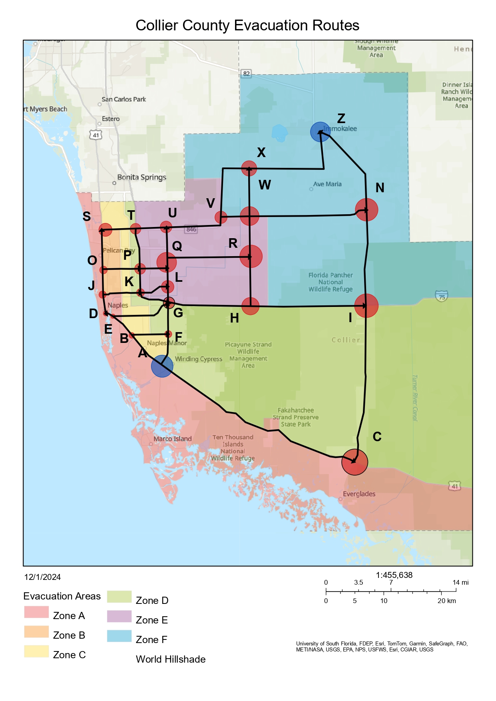

If you want to implement the algorithm you just need to follow the code inside `main.py` with the graph of your preference, it is important to set the full list of nodes before starting to add the edges.

`traffic-evacuation-volume.py` simulates the maximum traffic volume that can evacuate people from zones A and B (island areas) to a safer location near Immokalee, within Collier County.

The simulation was created using AADT (Annual Average Daily Traffic) data from the Florida Department of Transportation, which was then adjusted to reflect 10% of it's value (a realistic estimate of peak-hour volume per road).

Resources: [AADT](https://tdaappsprod.dot.state.fl.us/fto/), [Evacuation Order](https://www.colliercountyfl.gov/Home/Components/News/News/48963/7686)

